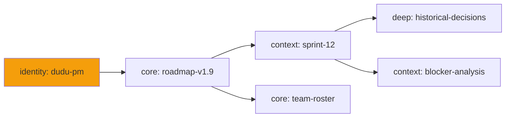

# Wiki Knowledge Layer

> Four layers of knowledge, trust-weighted — always-on for identity and core facts, on-demand for the deep archive.

---

## The Metaphor: A Doctor's Clinic

A doctor walking into an exam room has four tiers of knowledge at different mental distances:

1. **Identity** — "I am Dr. Chen, a cardiologist." Always present. Never retrieved; simply *who they are*.
2. **Core facts** — "This patient is allergic to penicillin. Today is Tuesday. The EHR system is up." Needed every consultation. Glanced at without thinking.
3. **Context** — "Last week this patient had an abnormal ECG; we're following up today." Recent, relevant, refreshed daily.
4. **Deep archive** — "That paper about rare arrhythmias from 2019." Retrieved only when something cues its relevance.

Loading *all* knowledge into working memory on every consultation would be exhausting and counterproductive. The doctor's brain layers knowledge by **injection frequency**, and DuDuClaw's Wiki does the same.

---

## The Four Layers

Inspired by the [Vault-for-LLM](https://github.com/BurkhardHagmann/Vault-for-LLM) 4-layer knowledge architecture, every Wiki page declares one of:

| Layer | Symbol | Frequency | Use Cases |
|-------|--------|-----------|-----------|
| **L0 Identity** | `identity` | Injected into every conversation | Agent/user identity, role, mission |
| **L1 Core** | `core` | Injected into every conversation | Environment, active projects, invariant rules |
| **L2 Context** | `context` | Daily refresh / on request | Recent decisions, debug logs, current sprint |
| **L3 Deep** | `deep` | Search-only, on-demand | Knowledge archive, historical notes, rare references |

Only L0 and L1 are auto-injected. L2 and L3 require an explicit search or refresh.

```markdown
---
title: Agent Mission Statement
layer: identity
trust: 1.0
tags: [identity, mission]
---

I am duduclaw-pm, the project manager for the DuDuClaw
v1.9 roadmap. My authority extends to...
```

---

## Trust Weighting

Every page carries a `trust` score (0.0 to 1.0) in its frontmatter:

```
trust: 1.0   — Source of truth (contract, policy)
trust: 0.7   — Verified current information
trust: 0.4   — Auto-ingested, unverified
trust: 0.1   — Speculative, draft
```

Search results are ranked by **trust-weighted score** = `fts5_rank × trust`. A high-trust page with moderate keyword relevance beats a low-trust page with higher raw relevance. This prevents hallucinated or auto-scraped content from out-ranking curated material.

---

## Auto-Injection Flow

The injection happens at system prompt assembly time — in three places, so all four runtimes (Claude / Codex / Gemini / OpenAI) get the same knowledge:

```
User sends message
     |
     v
Gateway routes to runtime
     |
     v
build_system_prompt(agent_id) assembles:
  ├─ Agent SOUL.md
  ├─ CONTRACT.toml (must_not / must_always)
  ├─ ## Your Team (sub-agent roster)
  ├─ Pinned instructions (session-scoped)
  ├─ Top-3 key facts (cross-session)
  └─ WIKI_CONTEXT module:
       └─ Collect all pages WHERE layer IN (identity, core)
       └─ Budget-aware truncation by priority
     |
     v
Three paths use the same module:
  1. runner.rs        (CLI interactive)
  2. channel_reply.rs (Telegram/LINE/Discord/Slack/...)
  3. claude_runner.rs (dispatcher/cron delegation)
```

Before v1.8.9, the Wiki accumulated pages via channel ingest and GVU evolution but **never fed them back** into LLM system prompts. Agents had knowledge they couldn't see. The auto-injection closes that loop.

---

## FTS5 Full-Text Index

All pages (regardless of layer) are indexed in a SQLite FTS5 virtual table with the `unicode61` tokenizer — which handles CJK characters correctly:

```
write_page("api-design.md") ──┐
delete_page("old-spec.md") ───┤── auto-sync
wiki_rebuild_fts MCP tool ────┘   (manual rebuild)
     |
     v
WikiFts SQLite virtual table
     |
     v
Search queries:
  wiki_search("rate limiting", min_trust=0.5, layer="core")
  shared_wiki_search("SOP", expand=true)
```

### Search Filters

```
min_trust: filter out draft/auto-ingest content
layer:     restrict to specific layer
expand:    1-hop backlink/related expansion
           (find pages linked-from and linking-to the hits)
```

### Backlink Expansion

Backlink expansion traces `related:` frontmatter and body markdown links in both directions:

```
Search hit: "payment-flow.md"
     |
     v
Backlinks: pages that link TO payment-flow.md
  ├─ "refund-policy.md"
  ├─ "stripe-integration.md"
  └─ "checkout-audit.md"
     |
     v
Forward-links: pages that payment-flow.md links to
  ├─ "api-keys.md"
  └─ "webhook-handlers.md"
     |
     v
All 6 pages included in expanded result
```

This is how a single targeted search pulls in an entire neighborhood of related knowledge.

---

## The Knowledge Graph

`wiki_graph` exports Mermaid diagrams of the wiki's interlink structure:



Node shapes vary by layer (identity = circle, core = rounded rectangle, context = rectangle, deep = stadium). The graph is BFS-limited by `center` and `depth` parameters so you can export a focused subset instead of the entire wiki.

---

## Dedup Detection

Over months of auto-ingest (channel conversations, GVU reflections), duplicate or near-duplicate pages accumulate:

```
wiki_dedup:
     |
     v
For each pair of pages:
  1. Title match (exact or fuzzy ≥ 0.9)
  2. Tag Jaccard similarity ≥ 0.8
     |
     v
Report candidate duplicates:
  [
    { "keep": "stripe-integration.md",
      "merge": "stripe-api-notes.md",
      "reason": "Tag Jaccard 0.88, title 0.95" }
  ]
```

The tool doesn't auto-merge — it surfaces candidates for human review.

---

## Shared Wiki

Beyond per-agent wikis, there's a shared wiki at `~/.duduclaw/shared/wiki/` for knowledge that spans the whole organization:

```
~/.duduclaw/
├── agents/
│   ├── dudu/wiki/          ← per-agent knowledge
│   └── xianwen/wiki/       ← per-agent knowledge
└── shared/wiki/            ← cross-agent SOPs, policies, product specs
```

Visibility is controlled via the `wiki_visible_to` capability on each page — default is agent-private, but pages can be promoted to shared or restricted to a team. MCP tools: `shared_wiki_ls`, `shared_wiki_read`, `shared_wiki_write`, `shared_wiki_search`, `shared_wiki_delete`, `shared_wiki_stats`, `wiki_share`.

---

## Cloud Ingest Integration

When channel conversations or external documents are ingested, the ingester assigns sensible defaults:

```
Auto-ingested content defaults:
  ├─ Source pages:   layer: context, trust: 0.4
  └─ Entity pages:   layer: deep,    trust: 0.3
```

Low trust by default — the agent can promote to higher layers after verification. The Cloud Ingest prompt explicitly instructs the LLM to assign `layer` and `trust` during extraction, so raw inputs arrive with a reasonable first estimate.

---

## CLAUDE_WIKI Template

Every new agent's `CLAUDE.md` now includes a CLAUDE_WIKI template that teaches the LLM how to use wiki tools:

```markdown
## Wiki Knowledge Base

You have access to a persistent wiki at <agent>/wiki/.
Use these tools to retrieve and update knowledge:

- wiki_search(query, min_trust, layer, expand)
- wiki_read(page_name)
- wiki_write(page_name, content, layer, trust)
- wiki_graph(center, depth)
- wiki_dedup()

L0 Identity + L1 Core pages are auto-injected — you don't
need to call wiki_read for those. Call wiki_search when
you need historical context or deep references.
```

Before this template, agents had access to wiki tools but rarely used them because they weren't aware of the wiki's existence or conventions. The template closes that instruction gap.

---

## Why This Matters

### Signal over Noise

Auto-injecting L0+L1 pages is roughly the same as having the doctor's identity and the current patient's allergies always in view. You don't wade through chart history to find them.

### Trust as a First-Class Signal

A `trust` score means the agent can reason about the reliability of its knowledge: "this pattern has trust 0.3, I should verify before acting." Knowledge isn't a boolean (present / absent) — it's a distribution.

### Runtime Agnostic

Claude, Codex, Gemini, and OpenAI-compatible runtimes all see the same wiki — because the injection happens *before* the runtime boundary, in `build_system_prompt`.

### Closes the Accumulation Loop

Before v1.8.9, the Wiki was write-only from the LLM's perspective: everyone could write, nobody could read (except through explicit `wiki_search` calls the LLM rarely made). Now every conversation reads the identity + core layers automatically.

---

## Interaction with Other Systems

- **GVU Loop**: SOUL.md updates can be triggered by patterns detected via wiki search — the evolution engine knows what the agent knows.
- **Skill Lifecycle**: Skill extraction consults the wiki for context. A skill synthesized from memory can cite the wiki pages that support it.
- **Security**: Wiki pages containing secrets get flagged by the same scanner that runs on other writable surfaces. The `must_not` rules in CONTRACT.toml can restrict which layers an agent is allowed to write to.
- **Dashboard**: The Knowledge Hub page renders the wiki with layer filters and a graph visualization.

---

## The Takeaway

Knowledge isn't a flat pile of documents — it's layered by how often you need to see it. DuDuClaw's Wiki makes that layering explicit, trust-weights every page, and auto-injects the must-always-remember tier directly into every system prompt. The deep archive stays quiet until summoned.
