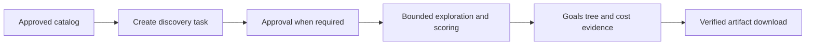

# Discovery — compare workspace solutions within a budget

Discovery asks an AI employee to try several workspace solutions, scores them with an operator-registered evaluator, and retains a verified result. Each run has limits on agent calls, dollars, wall time and rounds. The Goals page shows the exploration tree and its recorded evidence.

**Availability: in development.** The interface below describes the current source contract. Integration validation is ongoing; this page does not claim a released feature or completed browser acceptance.

## Use an approved workspace

1. Open **Goals**, select the employee, and find **Discovery**. The server catalog supplies approved workspace IDs, evaluator names and eligible runtimes. A missing catalog or create permission requires operator setup or an access grant.
2. Enter the goal, model, branch count, refinements per branch, parallelism and budget. Each branch runs once and is then refined that many times, so nodes per round = branches × (refinements + 1); the form shows the computed number, and 0 refinements is allowed. The request carries an approved root ID; it cannot supply a host path, account pool, sandbox override or policy source.
3. Create the task. An authorized manager can queue it directly. Other authorized callers receive `pending_approval`; an authorized manager approves the request in the Inbox before execution. A request waits at most 24 hours and is then cancelled automatically; the Goals card shows this deadline. If the requester cancels a request that is still waiting, the pending approval is withdrawn too and disappears from the manager's Inbox. The Inbox titles the approval as starting a code exploration and summarizes runtime, model, evaluator, branches, refinements, rounds, call limit, dollar budget and time limit above the raw spot-check view. Permissions come from authenticated server identity.
4. Follow each round's planned cells, completed cells, parent edges, status, score and observed model. Missing model metadata stays unknown. The dedicated discovery dispatcher executes `kind="discovery"` tasks.
5. Cancel an active run when needed. Use **Download verified files** only when a verified artifact is available. The server checks ownership and its persisted SHA-256 manifest before listing or returning bytes; a changed or missing artifact is refused.



Run status `degraded` means the run ended early. `stop_code` says why, for example `no_account` when no usable AI account was available (zero agent calls, zero cost). The amber isolation notice on the card appears only when `isolation_degraded` is true, that is, when the run really ran without the full OS isolation boundary. Read the run status, stop code and cost source before treating a result as comparable evidence. Run, approval and node statuses are shown as localized labels (English, Traditional Chinese, Japanese), and elapsed time with at most one decimal place.

The cumulative planned grid is limited to 20,000 cells: `branch_count × (refine_count + 1) × max_rounds` must stay within that limit, including dynamically planned rounds. Oversized historical runs remain in the list with `tree_available=false` and `tree_unavailable_reason`; their complete recorded cost subtotal remains visible, while a full tree request is refused. Requested parallelism may exceed the four shared public worker slots. Attempts wait for a slot within their original attempt and run deadlines; waiting spends no agent call and cancellation ends the wait.

## Public request reference

These JSON objects are protocol examples, not a live-run transcript. Obtain IDs and names from your installation's authenticated catalog.

```json
{"method":"discovery.catalog","params":{"agent_id":"researcher"}}
```

```json
{
  "method": "tasks.create",
  "params": {
    "assigned_to": "researcher",
    "kind": "discovery",
    "title": "Improve the parser fixture",
    "description": "Improve the parser while preserving the fixture results.",
    "discovery": {
      "approved_root_id": "<id returned by discovery.catalog>",
      "evaluator": "parser_score",
      "runtime": "claude",
      "model": "<model supported by the configured runtime>",
      "branch_count": 2,
      "refine_count": 1,
      "max_parallelism": 1,
      "budget": {"max_agent_calls": 6, "max_usd": 1.0, "max_wall_secs": 120, "max_rounds": 2}
    }
  }
}
```

Creation returns `task_id`, `run_id`, `status` (`queued` or `pending_approval`) and nullable `approval_id`. The optional `discovery.direction` accepts `max` (default) or `min`.

| Method | Parameters | Purpose |
|---|---|---|
| `discovery.catalog` | `agent_id` | Approved IDs, evaluator names, runtimes, `can_create`, `requires_approval` |
| `discovery.list` | optional `agent_id`, `limit` (1–100) | Runs visible to the caller |
| `discovery.tree` | `run_id` | Run, nodes and durable round records |
| `discovery.cancel` | `run_id` | Authorized cancellation |
| `discovery.artifact` | `run_id` | Verified metadata with opaque `file_id`, name and size |
| `discovery.artifact` | `run_id`, `file_id` | Bounded `content_base64` download; at most 16 MiB per file |

The run summary returned by `discovery.list` (`runs[]`) and `discovery.tree` (`run`) carries these approval and stop fields:

| Field | Values |
|---|---|
| `approval_status` | `pending`, `approved`, `denied`, `expired`, `withdrawn`, `not_required`; `decided` only for older rows with no decision receipt |
| `approval_expires_at` | RFC3339 time while waiting for approval (at most 24 hours), otherwise null |
| `isolation_degraded` | true only when the run ran without the full OS isolation boundary (operator-only experimental unconfined mode) |
| `degraded` | kept for compatibility: run status is `degraded`, or the run was unconfined; it no longer drives the isolation notice |
| `stop_code` | null, or `no_account`, `budget_exhausted`, `rate_limited`, `isolation_unavailable`, `runtime_unsupported`, `cleanup_failed`, `integrity_changed`, `winner_rejected`, `evaluator_unavailable`, `attempt_failed`, `tool_violation`, `other`; the raw internal reason is never exposed |
| `cancel_code` | null, or `approval_denied`, `approval_expired`, `cancelled_by_user` |

Discovery tasks also appear on the task board and the task detail page, where they are read-only: status, title, assignment, pinning, archiving and deletion are managed from the exploration section. The server refuses generic task updates and deletes for discovery tasks, and an employee hand-off does not reassign them.

Public views omit host paths, raw prompts and private policy code. MCP callers use the corresponding tool surface with a verified employee identity; task creation and delegation still pass server authorization and approval checks.

## Operator setup reference

Configure `<DUDUCLAW_HOME>/config.toml`, create an approved seed workspace, and install the trusted evaluator under `<DUDUCLAW_HOME>/discovery/evaluators/<name>`. Use a dedicated discovery account pool with usable credentials for the selected provider. Public requests cannot opt into shared channel accounts.

The following TOML shows real configuration keys. Replace every example path, pool label and image digest before use; it is not a prebuilt image or a tested deployment recipe.

```toml
[discovery]
approved_workspace_roots = ["/srv/discovery/workspace"]
account_pool = ["discovery-dedicated"]
allow_unconfined = false
max_starting_workspace_bytes = 67108864
max_run_bytes = 536870912
max_total_bytes = 2147483648
retained_hours = 24

[discovery.attempt]
sandbox = "container"
strict_usd = false
allow_shared_account_pool = false
memory_bytes = 4294967296
pids = 128
cpu_millis = 1000
tmp_bytes = 134217728
max_snapshot_bytes = 536870912

[discovery.attempt.runtimes.claude]
image = "registry.example/discovery-claude@sha256:<64-lowercase-hex-digest>"
executable = "/opt/runtime/claude"

[discovery.attempt.runtimes.codex]
image = "registry.example/discovery-codex@sha256:<64-lowercase-hex-digest>"
executable = "/usr/local/bin/codex"

[discovery.attempt.runtimes.antigravity]
image = "registry.example/discovery-agy@sha256:<64-lowercase-hex-digest>"
executable = "/usr/local/bin/agy"

[discovery.attempt.runtimes.grok]
image = "registry.example/discovery-grok@sha256:<64-lowercase-hex-digest>"
executable = "/usr/local/bin/grok"

[discovery.evaluators.parser_score]
command = ["/srv/dudu/discovery/evaluators/parser_score/score.py"]
sha256 = ""
sandbox = "container"
image = "registry.example/discovery-evaluator@sha256:<64-lowercase-hex-digest>"
good_solution = "/srv/dudu/discovery/evaluators/parser_score/good"
cheating_solution = "/srv/dudu/discovery/evaluators/parser_score/cheating"
timeout_secs = 30
memory_bytes = 536870912
pids = 64
scratch_bytes = 67108864
timing_sensitive = false
```

Here `/srv/dudu` stands for the configured home. The evaluator command must be an executable owned by the operator inside its registry directory; a Python script needs a compatible executable shebang. Add an entry only for the runtimes you want to offer. Container images must contain the runtime's CLI and `python3` for the trusted supervisor, and runtime executables must be Linux binaries inside the image. A macOS host binary cannot be mounted as a Linux runtime. Attempt, evaluator and policy containers are created with `--pull never`: an image that is not already on the machine is never fetched; creating the container fails instead. Pull each pinned image yourself before use.

Evaluator registration runs a known-good fixture and a known-cheating fixture, then persists the verified directory hash. The operator CLI entry is `duduclaw discover evaluator register parser_score`; employee CLI sessions cannot register evaluators. An evaluator receives JSON on stdin plus the workspace as its final argument. A successful envelope is:

```json
{"pass":true,"valid":true,"score":2.5,"fail_class":"ok","feedback":"verified"}
```

A rejected solution uses `valid:false`, `score:null` and a non-`ok` failure class. A known cheating fixture must never receive a valid score. Registry changes require registration again. `timing_sensitive=true` serializes scoring across runs with the same scorer hash; waiting consumes the deadline.

## Runtime and isolation boundaries

Discovery runs on six runtime families under the same guarantees: the attempt works inside its own node directory, can only read, write, edit, search and run shell commands (no MCP, web access, subagents, browser or image generation), and stops at the step ceiling (`max_turns`).

| Runtime | Config key (`[discovery.attempt.runtimes.<key>]`) | Step ceiling | Tool surface | Credentials |
|---|---|---|---|---|
| Claude | `claude` | Native `--max-turns` | `--tools` and `--allowedTools` | `ANTHROPIC_API_KEY` or `CLAUDE_CODE_OAUTH_TOKEN` |
| Codex | `codex` | Counted by the gateway | MCP, web, multi-agent, hooks, plugins and memory switched off through `-c` overrides | `OPENAI_API_KEY` (also passed as `CODEX_API_KEY`), or a credential document |
| Gemini (deprecated in v1.67.0, removed in v1.70.0; use Antigravity, see [deprecations](../guides/deprecations.md#gemini-cli-runtime)) | `gemini` | Native `maxSessionTurns` | `tools.core` allowlist | `GEMINI_API_KEY` or `GOOGLE_API_KEY` |
| Antigravity (`antigravity`, alias `agy`) | `antigravity` | Counted by the gateway | A `PreToolUse` hook denies every tool outside the file/shell set | `GEMINI_API_KEY` or `GOOGLE_API_KEY` only |
| Grok | `grok` | Native `--max-turns` | `--tools`, `--disallowed-tools`, `--disable-web-search`, `--no-subagents`, `--no-plan` | `XAI_API_KEY`, or a credential document |
| OpenAI-compatible (`openai-compat`, alias `openai_compat`) | `openai-compat` | The adapter's own loop | The adapter exposes file and shell tools only | The configured provider's key; also needs configured `base_url` |

This table concerns Discovery. Platform-wide interactive runtime support is unchanged. Catalog, creation and execution share the discovery capability gate; an image entry alone is insufficient, and `discovery.catalog` lists only the runtimes the operator has configured.

### How the limits are enforced

The gateway reads each attempt's event stream line by line and checks it itself; the CLI flags in the table are a second line of defence. A runtime without a native step flag therefore gets the same ceiling as one with it.

- **Step ceiling.** When an attempt exceeds `max_turns`, the gateway stops its container. This is not an error: whatever the workspace contains is still scored, as it is for Claude. For Codex a step is one file or shell tool call; for Antigravity a step is one model generation. Codex can emit several parallel tool calls in one generation, so its ceiling is never looser than Claude's.
- **Tool surface.** If an attempt uses any tool outside the file and shell surface, the gateway stops it, discards the attempt and ends the whole exploration with stop code `tool_violation`. The attempt is not retried. The audit log records a `discovery_tool_surface_violation` event.

### Credentials

Provide credentials only through the dedicated discovery account pool. Each runtime takes the environment variable shown in the table. Codex and Grok also accept a subscription login supplied as a credential document: add an OAuth account (provider `openai` for Codex, `xai` for Grok) to the dedicated pool whose stored secret is the content of that CLI's `auth.json`. The gateway checks that it is a JSON object of at most 64 KiB and writes it into the container's private home before the CLI starts; the variable that carried it is removed from the CLI's environment.

A token the CLI refreshes inside the container is not written back, because the container's home is deleted when it exits. Use a dedicated login for Discovery (log in once with a separate `CODEX_HOME` or `GROK_HOME` and put that file in the pool), and add it again when it expires. Sharing the `auth.json` of your everyday login can sign one side out if the provider rotates refresh tokens; the design has no first-hand evidence either way. API keys do not have this problem.

Antigravity works with a Gemini API key only. Its Google account login is stored in the operating-system keychain, and there is no path for it inside a container.

An account in the pool that has no usable credential for the chosen runtime is skipped. When the CLI reports an authentication failure, that account is not used again within the attempt; if the pool has no other usable account the run ends with `no_account` instead of retrying the same dead credential. Keys and credential documents are passed to the container by environment-variable name, so their values never appear on the host's process command line.

### Known limits

1. `sandbox = "none"` (the operator-only unconfined experiment) still supports Claude only. Other runtimes in that mode are refused as an unsupported capability.
2. Antigravity subscription logins cannot be used in the container; only a Gemini API key works.
3. Codex and Grok credential documents are not written back after a refresh (see above).
4. A Codex attempt stopped at the step ceiling has unknown cost, because Codex reports token usage only at the end of a turn.
5. The Codex stream does not report the model, so the node's model field stays empty. Antigravity is recorded only when its start event carries a model.
6. The gateway check reads the event stream that the CLI inside the container writes. It catches an AI that calls a disallowed tool in the normal way; a process inside the container that deliberately forges or garbles that stream is contained by the container boundary and the budget caps (call count, time). More than 3 unparsable lines in the stream stop the attempt with `tool_violation`.
7. Antigravity's `PreToolUse` hook configuration lives in the attempt's writable home, so it is only a second line of defence; the gateway check is what discards an attempt.

Formal runs require Container for attempts and evaluators. Each attempt receives only its own writable workspace, immutable snapshots of explicitly disclosed completed workspaces, and trusted read-only settings. Containers use a non-root user, read-only root filesystem, memory/process/CPU limits, bounded tmpfs and a trusted deadline supervisor. Cleanup must be confirmed before a result can be accepted; unresolved cleanup blocks execution.

Copying checks run/global quotas before and after materialization, including retry seeds and private snapshots. The writable host workspace bind **has no OS-enforced disk cap**. Explicit operator-only `none` experiments require separate opt-ins and are reported with status `degraded` and `isolation_degraded=true`; they provide no equivalent OS boundary and are never a fallback or a public task-body option. Production Native is refused.

## Read costs honestly

`usd_source` distinguishes `reported`, `estimated`, `unknown` and `pending`. Reported values come from runtime billing metadata; estimates come from token pricing. For non-Claude runtimes, a model missing from the price table is reported as unknown cost and charged at the full per-call reservation, instead of being estimated at Claude prices; add the model to `~/.duduclaw/models.toml` and it becomes an estimate. Unknown or unfinished calls retain a reserved liability instead of being assigned a zero-dollar bill. Run accounting includes infrastructure retries and policy development; displayed evaluated-node tokens are a narrower scope than all run calls.

`max_usd` is an admission/reservation limit, not a hard provider-side invoice ceiling. An in-flight generation may exceed an estimate. Strict dollar enforcement is refused when unsupported. First provider rate/usage limit cancels the run without account rotation or quota retries; infrastructure retries restore the immutable seed and reuse the identical prompt.

## Night-time learning from recorded worlds

For scheduled passes, set `[night_engine] enabled = true` in the employee's `agent.toml`. Keep global `[night] llm_enabled = false` when optional model phases should remain off; discovery replay itself makes no LLM calls.

The [night engine](58-night-engine.md) can compare frozen discovery policies on recorded worlds without LLM calls. It keeps each task intact, gives tasks equal weight, separates training from fresh held-out tasks, and durably consumes held-out evidence before evaluating a candidate on the held-out set. Defaults are scoped to employee, runtime, model, evaluator/hash and score direction; adoption checks version and evidence receipts.

The promotion gate requires at least eight training and eight distinct held-out tasks, strict training improvement, held-out mean lift of at least 0.01, and a one-sided Wilson/Bonferroni guard. Ties do not count as improvement. Missing data, insufficient fresh held-out tasks, incomplete or incompatible worlds, deadline/cancellation and invalid evidence leave defaults unchanged and yield no-data/report-only outcomes.

Activity reports contain hashes, counts, exclusions and statistical evidence; private policy source is withheld. These are comparisons on recorded worlds, not proof of causal efficacy or an optimal policy for new tasks. The discovery phase is zero-LLM; other opt-in night-engine phases have their own model budget.

## Related guides

- [Goals and their acceptance loop](34-goal-loop.md)
- [Live run forking](28-live-forking.md)
- [Night engine](58-night-engine.md)
- [Multi-runtime execution](13-multi-runtime.md)
