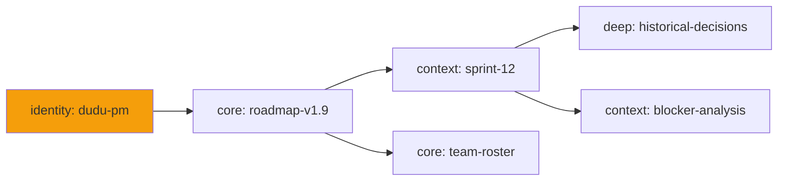

# Wiki Knowledge Layer

> 信頼度で重み付けされた4層の知識——アイデンティティと核心事実は常時オン、深層アーカイブはオンデマンド。

---

## たとえ話：医師のクリニック

診察室に入る医師には、それぞれ異なる心的距離にある4つの階層の知識があります：

1. **アイデンティティ** — 「私は陳医師、循環器内科医だ。」常に存在する。検索されることはなく、単に*その人が誰であるか*。
2. **核心事実** — 「この患者はペニシリンアレルギーがある。今日は火曜日。EHRシステムは稼働している。」診察のたびに必要。考えずにちらりと見る。
3. **コンテキスト** — 「先週この患者は異常な心電図を示した。今日はフォローアップだ。」最近の、関連する、毎日更新される。
4. **深層アーカイブ** — 「2019年の稀な不整脈についてのあの論文。」何かがその関連性を合図したときだけ検索される。

診察のたびに*すべての*知識をワーキングメモリに読み込むのは消耗が激しく逆効果です。医師の脳は知識を**注入頻度**で階層化しており、DuDuClawのWikiも同じことをします。

---

## 4つのレイヤー

[Vault-for-LLM](https://github.com/BurkhardHagmann/Vault-for-LLM)の4層知識アーキテクチャに着想を得て、すべてのWikiページは以下のいずれかを宣言します：

| レイヤー | シンボル | 頻度 | ユースケース |
|-------|--------|-----------|-----------|
| **L0 Identity** | `identity` | すべての会話に注入 | エージェント／ユーザーのアイデンティティ、役割、ミッション |
| **L1 Core** | `core` | すべての会話に注入 | 環境、進行中のプロジェクト、不変のルール |
| **L2 Context** | `context` | 毎日更新／リクエスト時 | 最近の決定、デバッグログ、現在のスプリント |
| **L3 Deep** | `deep` | 検索のみ、オンデマンド | 知識アーカイブ、履歴メモ、稀な参照 |

自動注入されるのはL0とL1のみです。L2とL3は明示的な検索または更新を必要とします。

```markdown
---
title: Agent Mission Statement
layer: identity
trust: 1.0
tags: [identity, mission]
---

I am duduclaw-pm, the project manager for the DuDuClaw
v1.9 roadmap. My authority extends to...
```

---

## 信頼度の重み付け

すべてのページは、そのfrontmatterに`trust`スコア（0.0から1.0）を持ちます：

```
trust: 1.0   — Source of truth (contract, policy)
trust: 0.7   — Verified current information
trust: 0.4   — Auto-ingested, unverified
trust: 0.1   — Speculative, draft
```

検索結果は**信頼度で重み付けされたスコア** = `fts5_rank × trust`でランク付けされます。キーワード関連度が中程度の高信頼ページは、生の関連度が高い低信頼ページに勝ります。これにより、ハルシネーションや自動スクレイピングされたコンテンツが、キュレーションされた素材を上回るランクに来ることを防ぎます。

---

## 自動注入フロー

注入はsystem prompt組み立て時に発生します——3つの場所で行われるため、4つすべてのruntime（Claude／Codex／Gemini／OpenAI）が同じ知識を得ます：

```
User sends message
     |
     v
Gateway routes to runtime
     |
     v
build_system_prompt(agent_id) assembles:
  ├─ Agent SOUL.md
  ├─ CONTRACT.toml (must_not / must_always)
  ├─ ## Your Team (sub-agent roster)
  ├─ Pinned instructions (session-scoped)
  ├─ Top-3 key facts (cross-session)
  └─ WIKI_CONTEXT module:
       └─ Collect all pages WHERE layer IN (identity, core)
       └─ Budget-aware truncation by priority
     |
     v
Three paths use the same module:
  1. runner.rs        (CLI interactive)
  2. channel_reply.rs (Telegram/LINE/Discord/Slack/...)
  3. claude_runner.rs (dispatcher/cron delegation)
```

v1.8.9以前、Wikiはchannel ingestとGVU進化を通じてページを蓄積していましたが、それらをLLMのsystem promptに**決してフィードバックしませんでした**。エージェントは自分には見えない知識を持っていたのです。自動注入はそのループを閉じます。

---

## FTS5全文インデックス

すべてのページは（レイヤーに関係なく）`unicode61`トークナイザーを使うSQLite FTS5仮想テーブルにインデックスされます——これはCJK文字を正しく扱います：

```
write_page("api-design.md") ──┐
delete_page("old-spec.md") ───┤── auto-sync
wiki_rebuild_fts MCP tool ────┘   (manual rebuild)
     |
     v
WikiFts SQLite virtual table
     |
     v
Search queries:
  wiki_search("rate limiting", min_trust=0.5, layer="core")
  shared_wiki_search("SOP", expand=true)
```

### 検索フィルター

```
min_trust: filter out draft/auto-ingest content
layer:     restrict to specific layer
expand:    1-hop backlink/related expansion
           (find pages linked-from and linking-to the hits)
```

### バックリンク展開

バックリンク展開は、`related:` frontmatterと本文のmarkdownリンクを双方向にたどります：

```
Search hit: "payment-flow.md"
     |
     v
Backlinks: pages that link TO payment-flow.md
  ├─ "refund-policy.md"
  ├─ "stripe-integration.md"
  └─ "checkout-audit.md"
     |
     v
Forward-links: pages that payment-flow.md links to
  ├─ "api-keys.md"
  └─ "webhook-handlers.md"
     |
     v
All 6 pages included in expanded result
```

これが、単一の的を絞った検索が関連知識の近傍一帯を引き込む仕組みです。

---

## ナレッジグラフ

`wiki_graph`はwikiの相互リンク構造のMermaid図をエクスポートします：



ノードの形はレイヤーによって変わります（identity = 円、core = 角丸長方形、context = 長方形、deep = スタジアム形）。グラフは`center`と`depth`パラメータでBFS制限されるため、wiki全体ではなく焦点を絞ったサブセットをエクスポートできます。

---

## 重複検出

数か月にわたる自動取り込み（channel会話、GVU反省）を経ると、重複またはほぼ重複するページが蓄積します：

```
wiki_dedup:
     |
     v
For each pair of pages:
  1. Title match (exact or fuzzy ≥ 0.9)
  2. Tag Jaccard similarity ≥ 0.8
     |
     v
Report candidate duplicates:
  [
    { "keep": "stripe-integration.md",
      "merge": "stripe-api-notes.md",
      "reason": "Tag Jaccard 0.88, title 0.95" }
  ]
```

このツールは自動マージしません——人間のレビューのために候補を浮かび上がらせます。

---

## Shared Wiki

エージェントごとのwikiに加えて、組織全体にまたがる知識のための共有wikiが`~/.duduclaw/shared/wiki/`にあります：

```
~/.duduclaw/
├── agents/
│   ├── dudu/wiki/          ← per-agent knowledge
│   └── xianwen/wiki/       ← per-agent knowledge
└── shared/wiki/            ← cross-agent SOPs, policies, product specs
```

可視性は各ページの`wiki_visible_to` capabilityで制御されます——デフォルトはエージェント専用ですが、ページは共有に昇格したり、チームに制限したりできます。MCPツール：`shared_wiki_ls`、`shared_wiki_read`、`shared_wiki_write`、`shared_wiki_search`、`shared_wiki_delete`、`shared_wiki_stats`、`wiki_share`。

### ネームスペースSoTポリシー（`.scope.toml`）

オペレーターは、共有wiki内のどのトップレベルネームスペースが**外部システムの権威あるコピー**（Notion、LDAP、ガバナンスポリシーバンドル）であり、進化するエージェントによって黙って上書きされてはならないかを宣言できます。`~/.duduclaw/shared/wiki/.scope.toml`を置きます：

```toml
# Identity is owned by the IdentityProvider sync — no agent may write here
[namespaces."identity"]
mode         = "read_only"
synced_from  = "identity-provider"

# Access control list is owned by the governance policy bundle
[namespaces."access"]
mode         = "read_only"
synced_from  = "policy-registry"

# SOPs continue to be agent-writable (also the default for unlisted namespaces)
[namespaces."SOP"]
mode         = "agent_writable"

# Production policies are operator-only — never writable via MCP
[namespaces."policies"]
mode         = "operator_only"
```

3つのモード：

| モード | Agents（MCPパス） | `synced_from`に一致する内部capability | オペレーターCLI |
|---|---|---|---|
| `agent_writable` | ✅ 許可 | ✅ 許可 | ✅ 許可 |
| `read_only` | ❌ 拒否 | ✅ 許可 | ✅ 許可 |
| `operator_only` | ❌ 拒否 | ❌ 拒否 | ✅ 許可 |

`shared_wiki_write`と`shared_wiki_delete`の両方がこのポリシーを尊重します。リストにないネームスペースはデフォルトで`agent_writable`です——ポリシーは*締めるだけ*で、決して緩めません。

**フェイルセーフ：** ファイルなし ⇒ ポリシーなし ⇒ 既存の挙動。不正なTOML ⇒ 警告をログに記録 + ポリシーなしとして扱う。gatewayが壊れたポリシーファイルにブロックされることは決してありません。

**ホットリロード：** ポリシーはwrite／deleteのたびに再読み込みされます（ファイルは小さく、パフォーマンスへの影響は無視できます）。オペレーターの編集は即座に反映されます。

書き込み前に`wiki_namespace_status` MCPツールを使って、現在有効なポリシーを確認してください。

---

## Cloud Ingest連携

channel会話や外部ドキュメントが取り込まれるとき、取り込み器は妥当なデフォルトを割り当てます：

```
Auto-ingested content defaults:
  ├─ Source pages:   layer: context, trust: 0.4
  └─ Entity pages:   layer: deep,    trust: 0.3
```

デフォルトは低信頼——エージェントは検証後により高いレイヤーへ昇格できます。Cloud IngestのプロンプトはLLMに対し、抽出中に`layer`と`trust`を割り当てるよう明示的に指示するため、生の入力は妥当な初期推定を伴って到着します。

---

## CLAUDE_WIKIテンプレート

すべての新しいエージェントの`CLAUDE.md`には、LLMにwikiツールの使い方を教えるCLAUDE_WIKIテンプレートが含まれるようになりました：

```markdown
## Wiki Knowledge Base

You have access to a persistent wiki at <agent>/wiki/.
Use these tools to retrieve and update knowledge:

- wiki_search(query, min_trust, layer, expand)
- wiki_read(page_name)
- wiki_write(page_name, content, layer, trust)
- wiki_graph(center, depth)
- wiki_dedup()

L0 Identity + L1 Core pages are auto-injected — you don't
need to call wiki_read for those. Call wiki_search when
you need historical context or deep references.
```

このテンプレートが登場する前、エージェントはwikiツールへのアクセス権を持っていましたが、wikiの存在や規約を知らなかったため、ほとんど使いませんでした。このテンプレートはその指示のギャップを埋めます。

---

## なぜ重要か

### ノイズよりシグナル

L0+L1ページの自動注入は、医師のアイデンティティと現在の患者のアレルギーを常に視界に入れておくのとおおよそ同じです。それらを見つけるためにカルテ履歴をかき分ける必要はありません。

### 第一級シグナルとしての信頼度

`trust`スコアは、エージェントが自身の知識の信頼性について推論できることを意味します：「このパターンは信頼度0.3だ、行動する前に検証すべきだ。」知識はブール値（存在／不在）ではなく——分布なのです。

### Runtime非依存

Claude、Codex、Gemini、OpenAI互換runtimeはすべて同じwikiを見ます——注入がruntime境界の*前*、`build_system_prompt`で行われるからです。

### 蓄積ループを閉じる

v1.8.9以前、LLMの視点からはWikiは書き込み専用でした：誰もが書けて、誰も読めなかった（LLMがめったに行わない明示的な`wiki_search`呼び出しを除いて）。今やすべての会話がidentity + coreレイヤーを自動的に読み込みます。

---

## 他システムとの連携

- **GVUループ**：SOUL.md更新は、wiki検索を通じて検出されたパターンによってトリガーされうる——進化エンジンはエージェントが何を知っているかを知っている。
- **スキルライフサイクル**：スキル抽出はコンテキストのためにwikiを参照する。メモリから合成されたスキルは、それを裏付けるwikiページを引用できる。
- **セキュリティ**：機密を含むwikiページは、他の書き込み可能な面で実行されるのと同じスキャナーによってフラグ付けされる。CONTRACT.tomlの`must_not`ルールは、エージェントがどのレイヤーに書き込めるかを制限できる。
- **Dashboard**：Knowledge Hubページは、レイヤーフィルターとグラフ可視化を備えたwikiをレンダリングする。

---

## まとめ

知識はドキュメントの平らな山ではなく——どれくらいの頻度で見る必要があるかで階層化されています。DuDuClawのWikiはその階層化を明示化し、すべてのページに信頼度の重みを付け、「常に覚えておくべき」層を直接すべてのsystem promptに自動注入します。深層アーカイブは、呼び出されるまで静かに控えています。
