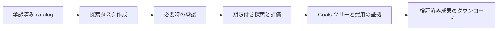

# Discovery — 予算内でワークスペースの解法を比較する

Discovery は AI 従業員に複数の解法を試させ、運用者が登録した評価器で採点し、検証済みの成果を保持します。実行ごとに agent 呼び出し回数、ドル、経過時間、ラウンド数を制限し、Goals ページで探索ツリーと記録された証拠を確認できます。

**現在は開発・統合検証中です。** 以下は現在のソースコードのインターフェース契約です。リリース済み、またはブラウザー受け入れ検証済みとはしていません。

## 承認済みワークスペースを使う

1. **Goals** で従業員を選び、**Discovery** を開きます。サーバーの catalog が承認済みワークスペース ID、評価器名、利用条件を満たす runtime を返します。catalog や作成権限がない場合は、運用者の設定またはアクセス許可が必要です。
2. 目標、モデル、ブランチ数、分岐ごとの改良回数、並列数、予算を入力します。各ブランチは一度実行された後、指定回数だけ改良されるため、ラウンドあたりのノード数 = ブランチ数 × (改良回数 + 1) です。フォームは計算結果を表示し、改良回数は 0 も指定できます。リクエストは approved root ID を使います。ホストパス、アカウントプール、sandbox の上書き、ポリシーのソースは渡せません。
3. タスクを作成します。その従業員を管理できる manager は直接キューに入れられます。その他の権限を持つ依頼者は `pending_approval` となり、権限のある manager が受信トレイで承認した後に実行されます。リクエストの待機は最長 24 時間で、超過すると自動的にキャンセルされ、Goals カードにこの期限が表示されます。依頼者が待機中のリクエストをキャンセルすると、保留中の承認も取り下げられ、manager の受信トレイから消えます。受信トレイでは、この承認を「コード探索を1回開始する」として表示し、元の抜き取り確認ビューの上に runtime、モデル、評価器、ブランチ数、改良回数、ラウンド数、呼び出し上限、ドル予算、時間上限の概要を示します。権限は認証済みのサーバー側 identity で決まります。
4. 各ラウンドの計画セル、完了セル、親子関係、状態、スコア、観測されたモデルを確認します。モデル情報がない場合は不明のままです。`kind="discovery"` タスクは専用 dispatcher が実行します。
5. 必要なら実行中の run をキャンセルします。検証済み artifact がある場合は **検証済みファイルをダウンロード** を使います。サーバーは所有権と永続 SHA-256 manifest を確認してから一覧や内容を返します。変更・消失した artifact は拒否します。



run の状態 `degraded` は、その run が途中で終了したことを示し、`stop_code` が理由を示します。たとえば使える AI アカウントがなかった場合は `no_account` です（agent 呼び出し 0 回、費用 0）。カード上の琥珀色の隔離通知は、`isolation_degraded` が true の場合、つまり run が実際に完全な OS 隔離境界なしで実行された場合にのみ表示されます。結果を比較する前に、run の状態、停止コード、費用の出所を確認してください。run、承認、node の状態は各言語（英語・繁体字中国語・日本語）のラベルで表示され、経過時間は小数点以下 1 桁までです。

累積の計画グリッドは 20,000 セルまでです。`branch_count × (refine_count + 1) × max_rounds` はこの上限以内とし、動的ポリシーが計画する各 round にも適用します。過去の大きすぎる run は一覧に残り、`tree_available=false` と `tree_unavailable_reason` を返します。記録済み費用の小計は保持し、完全な tree 取得は拒否します。要求 parallelism が公開 runner 共通の四つの worker slot を超える場合、attempt は元の attempt／run deadline 内で空きを待ちます。待機は agent call を消費せず、cancel で終了します。

## 公開リクエストのリファレンス

以下はプロトコル例であり、実行記録ではありません。ID と名前は自分の環境の認証済み catalog から取得してください。

```json
{"method":"discovery.catalog","params":{"agent_id":"researcher"}}
```

```json
{
  "method": "tasks.create",
  "params": {
    "assigned_to": "researcher",
    "kind": "discovery",
    "title": "Improve the parser fixture",
    "description": "Improve the parser while preserving the fixture results.",
    "discovery": {
      "approved_root_id": "<id returned by discovery.catalog>",
      "evaluator": "parser_score",
      "runtime": "claude",
      "model": "<model supported by the configured runtime>",
      "branch_count": 2,
      "refine_count": 1,
      "max_parallelism": 1,
      "budget": {"max_agent_calls": 6, "max_usd": 1.0, "max_wall_secs": 120, "max_rounds": 2}
    }
  }
}
```

作成結果は `task_id`、`run_id`、`status`（`queued` または `pending_approval`）、null 許容の `approval_id` を返します。任意の `discovery.direction` は `max`（既定）または `min` です。

| メソッド | パラメーター | 用途 |
|---|---|---|
| `discovery.catalog` | `agent_id` | 承認済み ID、評価器名、runtime、`can_create`、`requires_approval` |
| `discovery.list` | 任意の `agent_id`、`limit`（1–100） | 呼び出し元に見える run |
| `discovery.tree` | `run_id` | run、node、永続ラウンド記録 |
| `discovery.cancel` | `run_id` | 権限確認付きキャンセル |
| `discovery.artifact` | `run_id` | 検証済み metadata：opaque `file_id`、名前、サイズ |
| `discovery.artifact` | `run_id`、`file_id` | 上限付き `content_base64` ダウンロード。1 ファイル最大 16 MiB |

`discovery.list`（`runs[]`）と `discovery.tree`（`run`）が返す run サマリーには、次の承認・停止フィールドが含まれます。

| フィールド | 値 |
|---|---|
| `approval_status` | `pending`、`approved`、`denied`、`expired`、`withdrawn`、`not_required`。`decided` は決定レシートのない旧データにのみ現れます |
| `approval_expires_at` | 承認待ちの間は RFC3339 時刻（最長 24 時間）、それ以外は null |
| `isolation_degraded` | run が完全な OS 隔離境界なしで実行された場合（運用者専用の実験的 unconfined モード）のみ true |
| `degraded` | 互換性のため維持：run の状態が `degraded`、または unconfined で実行された場合。隔離通知の判定には使われません |
| `stop_code` | null、または `no_account`、`budget_exhausted`、`rate_limited`、`isolation_unavailable`、`runtime_unsupported`、`cleanup_failed`、`integrity_changed`、`winner_rejected`、`evaluator_unavailable`、`attempt_failed`、`tool_violation`、`other`。内部の生の理由は公開されません |
| `cancel_code` | null、または `approval_denied`、`approval_expired`、`cancelled_by_user` |

探索タスクはタスクボードとタスク詳細ページにも表示されますが、そこでは読み取り専用です。状態、タイトル、担当、ピン留め、アーカイブ、削除は探索セクションで管理します。サーバーは汎用タスク画面からの探索タスクの更新と削除を拒否し、社員の引き継ぎでも探索タスクは再割り当てされません。

公開ビューにホストパス、raw prompt、私有ポリシーコードは含めません。MCP 呼び出し元は対応するツールと検証済み従業員 identity を使用します。作成・委任はサーバーの権限と承認チェックを通ります。

## 運用者向け設定リファレンス

`<DUDUCLAW_HOME>/config.toml` を設定し、承認済み seed workspace を用意し、信頼する評価器を `<DUDUCLAW_HOME>/discovery/evaluators/<name>` に置きます。選んだ provider の有効な認証情報を持つ Discovery 専用アカウントプールを使用します。公開リクエストから共有チャネルアカウントを選ぶことはできません。

以下は実在する設定キーの例です。使用前に例のパス、プール名、image digest をすべて置き換えてください。配布済み image や実地検証済みの導入手順ではありません。

```toml
[discovery]
approved_workspace_roots = ["/srv/discovery/workspace"]
account_pool = ["discovery-dedicated"]
allow_unconfined = false
max_starting_workspace_bytes = 67108864
max_run_bytes = 536870912
max_total_bytes = 2147483648
retained_hours = 24

[discovery.attempt]
sandbox = "container"
strict_usd = false
allow_shared_account_pool = false
memory_bytes = 4294967296
pids = 128
cpu_millis = 1000
tmp_bytes = 134217728
max_snapshot_bytes = 536870912

[discovery.attempt.runtimes.claude]
image = "registry.example/discovery-claude@sha256:<64-lowercase-hex-digest>"
executable = "/opt/runtime/claude"

[discovery.attempt.runtimes.codex]
image = "registry.example/discovery-codex@sha256:<64-lowercase-hex-digest>"
executable = "/usr/local/bin/codex"

[discovery.attempt.runtimes.antigravity]
image = "registry.example/discovery-agy@sha256:<64-lowercase-hex-digest>"
executable = "/usr/local/bin/agy"

[discovery.attempt.runtimes.grok]
image = "registry.example/discovery-grok@sha256:<64-lowercase-hex-digest>"
executable = "/usr/local/bin/grok"

[discovery.evaluators.parser_score]
command = ["/srv/dudu/discovery/evaluators/parser_score/score.py"]
sha256 = ""
sandbox = "container"
image = "registry.example/discovery-evaluator@sha256:<64-lowercase-hex-digest>"
good_solution = "/srv/dudu/discovery/evaluators/parser_score/good"
cheating_solution = "/srv/dudu/discovery/evaluators/parser_score/cheating"
timeout_secs = 30
memory_bytes = 536870912
pids = 64
scratch_bytes = 67108864
timing_sensitive = false
```

ここで `/srv/dudu` は設定された home を表します。評価コマンドは registry 内の運用者所有の実行可能ファイルである必要があります。Python script には互換性のある実行可能 shebang が必要です。提供したい runtime の分だけブロックを追加してください。image は、その runtime の CLI と信頼する supervisor 用の `python3` を含み、runtime executable は image 内の Linux バイナリーでなければなりません。macOS ホストの binary を Linux runtime としてマウントすることはできません。試行、評価、ポリシーのコンテナは `--pull never` で作成されます。マシンにないイメージは取得されず、コンテナの作成が失敗します。使用前に、固定した各イメージを自分で pull してください。

評価器登録は既知の正常解と既知の不正解を実行し、検証済みディレクトリ hash を保存します。運用者 CLI は `duduclaw discover evaluator register parser_score` です。従業員の CLI セッションは登録できません。評価器は stdin の JSON と、最後の引数として workspace を受け取ります。成功 envelope は次の形式です。

```json
{"pass":true,"valid":true,"score":2.5,"fail_class":"ok","feedback":"verified"}
```

拒否した解は `valid:false`、`score:null`、`ok` 以外の failure class を使います。既知の不正解には有効スコアを与えてはいけません。Registry を変更したら再登録が必要です。`timing_sensitive=true` は同じ評価器 hash の run 間評価を直列化し、待機時間も期限に含めます。

## Runtime と隔離の境界

Discovery は 6 つの runtime ファミリーを同じ保証のもとで実行します。attempt は自分のノードディレクトリ内でのみ作業し、ファイルの読み取り・書き込み・編集・検索と shell コマンドの実行だけができ（MCP、Web アクセス、subagent、ブラウザー、画像生成は使えません）、ステップ上限（`max_turns`）で止まります。

| Runtime | 設定キー（`[discovery.attempt.runtimes.<キー>]`） | ステップ上限 | ツール制限 | 受け付ける認証情報 |
|---|---|---|---|---|
| Claude | `claude` | ネイティブの `--max-turns` | `--tools` と `--allowedTools` | `ANTHROPIC_API_KEY` または `CLAUDE_CODE_OAUTH_TOKEN` |
| Codex | `codex` | gateway がカウント | `-c` の上書きで MCP、web、マルチエージェント、hook、プラグイン、メモリーを無効化 | `OPENAI_API_KEY`（同じ値を `CODEX_API_KEY` にも設定）、または認証情報ドキュメント |
| Gemini（v1.67.0 で非推奨、v1.71.0 で削除。Antigravity を使用。[非推奨ガイド](../../guides/ja-JP/deprecations.md#gemini-cli-ランタイム)参照） | `gemini` | ネイティブの `maxSessionTurns` | `tools.core` の許可リスト | `GEMINI_API_KEY` または `GOOGLE_API_KEY` |
| Antigravity（`antigravity`、別名 `agy`） | `antigravity` | gateway がカウント | `PreToolUse` hook がファイル／shell 以外のツールをすべて拒否 | `GEMINI_API_KEY` または `GOOGLE_API_KEY` のみ |
| Grok | `grok` | ネイティブの `--max-turns` | `--tools`、`--disallowed-tools`、`--disable-web-search`、`--no-subagents`、`--no-plan` | `XAI_API_KEY`、または認証情報ドキュメント |
| OpenAI 互換（`openai-compat`、別名 `openai_compat`） | `openai-compat` | adapter 自身のループ | adapter はファイルと shell のツールのみ提供 | 設定された provider の key。`base_url` の設定も必要 |

この表は Discovery に関するものです。プラットフォーム全体の対話 runtime 対応は変わりません。Catalog、作成、実行は共通の能力ゲートを使い、image の設定だけでは通過できません。`discovery.catalog` に表示されるのは、運用者が設定した runtime のみです。

### 制限の適用方法

gateway は各 attempt のイベントストリームを 1 行ずつ読み、自分で検査します。表の CLI フラグは第二の防御線です。そのため、ネイティブのステップフラグを持たない runtime も、持つ runtime と同じ上限になります。

- **ステップ上限。** attempt が `max_turns` を超えると、gateway がそのコンテナーを停止します。これはエラーではなく、Claude と同様に workspace にあるものがそのまま採点されます。Codex の 1 ステップはファイルまたは shell ツールの 1 回の呼び出し、Antigravity の 1 ステップはモデルの 1 回の生成です。Codex は 1 回の生成で複数のツールを並列に呼ぶことがあるため、その上限が Claude より緩くなることはありません。
- **ツール制限。** attempt がファイルと shell 以外のツールを 1 つでも使うと、gateway はそれを停止して attempt を破棄し、探索全体を停止コード `tool_violation` で終了します。再試行はしません。監査ログには `discovery_tool_surface_violation` イベントが記録されます。

### 認証情報

認証情報は Discovery 専用のアカウントプール経由でのみ渡します。各 runtime は表の環境変数を使います。Codex と Grok は、認証情報ドキュメントとして渡すサブスクリプションのログインも受け付けます。専用プールに OAuth アカウント（Codex は provider `openai`、Grok は `xai`）を追加し、保存するシークレットをその CLI の `auth.json` の内容にします。gateway は、それが 64 KiB 以下の JSON オブジェクトであることを確認し、CLI の起動前にコンテナーの私的な home に書き込み、渡すのに使った変数は CLI の環境から取り除きます。

CLI がコンテナー内で更新した token は書き戻されません。コンテナー終了時に home が削除されるためです。Discovery には専用のログインを使ってください（別の `CODEX_HOME` または `GROK_HOME` で一度ログインし、そのファイルをプールに入れます）。期限が切れたら入れ直します。日常使いのログインと同じ `auth.json` を共有すると、provider が refresh token を回転させる場合に片方がログアウトされる可能性があります。実際の挙動を示す一次情報は現時点でありません。API key にはこの問題がありません。

Antigravity は Gemini API key のみで動作します。Google アカウントのログインは OS のキーチェーンに保存され、コンテナー内で使える経路がありません。

アカウントプール内で、選択した runtime に使える認証情報を持たないアカウントはスキップされます。CLI が認証失敗を報告した場合、そのアカウントは同じ attempt 内では再使用されません。プールに他の使えるアカウントがなければ、同じ無効な認証情報で再試行を繰り返さず `no_account` で終了します。キーと認証情報ドキュメントは環境変数名でコンテナーに渡され、値がホストのプロセスのコマンドラインに現れることはありません。

### 既知の制限

1. `sandbox = "none"`（運用者専用の unconfined 実験モード）は引き続き Claude のみ対応です。このモードの他の runtime は、未対応の能力として拒否されます。
2. Antigravity のサブスクリプションログインはコンテナー内で使えません。Gemini API key のみ使えます。
3. Codex と Grok の認証情報ドキュメントは、token 更新後に書き戻されません（上記参照）。
4. Codex の attempt がステップ上限で停止された場合、費用は不明です。Codex は token 使用量をターン終了時にしか報告しないためです。
5. Codex のストリームはモデルを報告しないため、node のモデル欄は空のままです。Antigravity は開始イベントにモデルが含まれる場合のみ記録します。
6. gateway の検査が読むのは、コンテナー内の CLI 自身が出力するイベントストリームです。AI が通常の方法で許可されていないツールを呼び出した場合は検出できます。コンテナー内のプロセスが意図的にストリームを偽造または攪乱した場合、それを囲い込むのはコンテナー境界と予算上限（呼び出し回数、時間）です。ストリームに解析できない行が 3 行を超えて現れると、attempt は `tool_violation` で停止します。
7. Antigravity の `PreToolUse` hook 設定は attempt が書き込める home 内にあるため、第二の防御線にとどまります。attempt を破棄するのは gateway の検査です。

正式な run は attempt と evaluator に Container を要求します。Attempt に渡すのは自分の書き込み可能 workspace、明示的に公開された完了 workspace の不変 snapshot、信頼する読み取り専用設定のみです。非 root、読み取り専用 root filesystem、メモリー／プロセス／CPU 制限、上限付き tmpfs、信頼する deadline supervisor を使用します。結果を受け入れる前に cleanup を確認し、未確認の cleanup があれば実行を止めます。

コピーの前後で retry seed と私有 snapshot を含む run／全体 quota を検査します。書き込み可能な host workspace bind に **OS 強制のハードディスク上限はありません**。`none` は明示的な運用者 opt-in の実験専用で、状態は `degraded`、`isolation_degraded=true` になります。同等の OS 境界はなく、自動 fallback や公開 task body の選択肢ではありません。正式な Native 実行は拒否します。

## 費用を正しく読む

`usd_source` は `reported`、`estimated`、`unknown`、`pending` を区別します。Reported は runtime の課金 metadata、estimated は token 単価による推計です。Claude 以外の runtime では、価格表にないモデルは費用不明として扱われ、呼び出しごとの予約額の全額が計上されます。Claude の価格での推計はもう行いません。そのモデルを `~/.duduclaw/models.toml` に追加すると推計値になります。不明または未完了の呼び出しは予約責任を保持し、ゼロドル請求を作りません。Run 会計には infrastructure retry とポリシー開発を含めます。表示される評価済み node の token は、run 全呼び出しより狭い範囲です。

`max_usd` は dispatch／予約上限で、provider 請求のハード上限ではありません。実行中の generation は見積もりを超えることがあります。厳密なドル制限を保証できない runtime は要求を拒否します。最初の provider rate／usage limit で run をキャンセルし、アカウント切り替えや quota retry は行いません。Infrastructure retry は不変 seed を復元し、同一 prompt を再送します。

## 記録された world を使う夜間学習

定期実行には従業員の `agent.toml` で `[night_engine] enabled = true` を設定します。任意のモデルフェーズを停止したままにする場合は、全体の `[night] llm_enabled = false` を維持します。Discovery の replay 自体は LLM を呼び出しません。

[ナイトエンジン](58-night-engine.md) は LLM 呼び出しなしで、記録済み world 上の凍結ポリシーを比較できます。Task を分割せず、task ごとに同じ重みを与え、training と新しい held-out task を分離します。候補の held-out 評価前に、その証拠の使用を永続記録します。Defaults は従業員、runtime、モデル、評価器／hash、スコア方向ごとに保存し、採用時に version と証拠 receipt を確認します。

採用ゲートは training task 8 件以上、異なる held-out task 8 件以上、training の厳密な改善、held-out 平均 lift 0.01 以上、片側 Wilson／Bonferroni 検査を要求します。同点は改善に数えません。データ不足、新しい held-out task 不足、不完全・非互換 world、期限／キャンセル、無効証拠の場合は defaults を維持し、no-data／report-only とします。

Activity レポートは hash、件数、除外理由、統計的証拠を含め、私有ポリシーソースを公開しません。これは記録 world 上の比較であり、因果的な効果や新しい task の最適ポリシーの証明ではありません。Discovery フェーズはゼロ LLM です。他の opt-in ナイトフェーズは独自のモデル予算を持ちます。

## 関連ガイド

- [Goal と受け入れループ](34-goal-loop.md)
- [ライブ実行フォーク](28-live-forking.md)
- [ナイトエンジン](58-night-engine.md)
- [複数 runtime 実行](13-multi-runtime.md)
