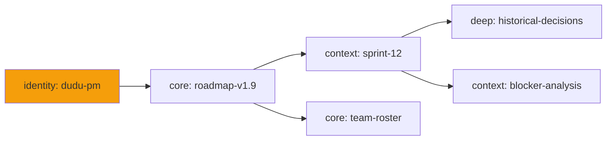

# Wiki Knowledge Layer

> 四層知識，依信任度加權——身分與核心事實常駐，深層典藏則按需取用。

---

## 比喻：醫師的診間

醫師走進診間時，心智距離不一的四個層級知識同時在場：

1. **身分** — 「我是陳醫師，一位心臟科醫師。」永遠在場。從不需檢索；那單純就是*他們是誰*。
2. **核心事實** — 「這位病人對盤尼西林過敏。今天是星期二。EHR 系統正常運作。」每次門診都需要。看一眼，不假思索。
3. **脈絡** — 「上週這位病人有異常心電圖；今天回診追蹤。」近期、相關、每日更新。
4. **深層典藏** — 「2019 年那篇關於罕見心律不整的論文。」只在某事提示其相關性時才檢索。

每次門診都把*全部*知識載入工作記憶會令人精疲力竭且適得其反。醫師的大腦依**注入頻率**將知識分層，DuDuClaw 的 Wiki 也是如此。

---

## 四個層級

受 [Vault-for-LLM](https://github.com/BurkhardHagmann/Vault-for-LLM) 四層知識架構啟發，每個 Wiki 頁面都宣告以下其中一種：

| 層級 | 符號 | 頻率 | 使用情境 |
|-------|--------|-----------|-----------|
| **L0 Identity** | `identity` | 注入每一段對話 | Agent／使用者身分、角色、使命 |
| **L1 Core** | `core` | 注入每一段對話 | 環境、進行中的專案、不變的規則 |
| **L2 Context** | `context` | 每日更新／按需 | 近期決策、除錯紀錄、當前 sprint |
| **L3 Deep** | `deep` | 僅搜尋、按需 | 知識典藏、歷史筆記、罕見參考 |

只有 L0 與 L1 會自動注入。L2 與 L3 需要明確的搜尋或更新。

```markdown
---
title: Agent Mission Statement
layer: identity
trust: 1.0
tags: [identity, mission]
---

I am duduclaw-pm, the project manager for the DuDuClaw
v1.9 roadmap. My authority extends to...
```

---

## 信任度加權

每個頁面在其 frontmatter 中都帶有一個 `trust` 分數（0.0 到 1.0）：

```
trust: 1.0   — Source of truth (contract, policy)
trust: 0.7   — Verified current information
trust: 0.4   — Auto-ingested, unverified
trust: 0.1   — Speculative, draft
```

搜尋結果依**信任度加權分數** = `fts5_rank × trust` 排名。一個高信任度但關鍵字相關度中等的頁面，會勝過一個低信任度但原始相關度較高的頁面。這可防止幻覺或自動抓取的內容在排名上勝過經人工整理的素材。

---

## 自動注入流程

注入發生在組裝 system prompt 時——分布在三個地方，因此四種 runtime（Claude／Codex／Gemini／OpenAI）都能得到相同的知識：

```
User sends message
     |
     v
Gateway routes to runtime
     |
     v
build_system_prompt(agent_id) assembles:
  ├─ Agent SOUL.md
  ├─ CONTRACT.toml (must_not / must_always)
  ├─ ## Your Team (sub-agent roster)
  ├─ Pinned instructions (session-scoped)
  ├─ Top-3 key facts (cross-session)
  └─ WIKI_CONTEXT module:
       └─ Collect all pages WHERE layer IN (identity, core)
       └─ Budget-aware truncation by priority
     |
     v
Three paths use the same module:
  1. runner.rs        (CLI interactive)
  2. channel_reply.rs (Telegram/LINE/Discord/Slack/...)
  3. claude_runner.rs (dispatcher/cron delegation)
```

在 v1.8.9 之前，Wiki 透過 channel ingest 與 GVU 演化累積頁面，卻**從未把它們回饋**到 LLM 的 system prompt。Agent 擁有自己看不到的知識。自動注入閉合了這個迴圈。

---

## FTS5 全文索引

所有頁面（不論層級）都被索引在一個 SQLite FTS5 虛擬表中，使用 `unicode61` tokenizer——它能正確處理 CJK 字元：

```
write_page("api-design.md") ──┐
delete_page("old-spec.md") ───┤── auto-sync
wiki_rebuild_fts MCP tool ────┘   (manual rebuild)
     |
     v
WikiFts SQLite virtual table
     |
     v
Search queries:
  wiki_search("rate limiting", min_trust=0.5, layer="core")
  shared_wiki_search("SOP", expand=true)
```

### 搜尋過濾器

```
min_trust: filter out draft/auto-ingest content
layer:     restrict to specific layer
expand:    1-hop backlink/related expansion
           (find pages linked-from and linking-to the hits)
```

### Backlink 擴展

Backlink 擴展會雙向追蹤 `related:` frontmatter 與本文 markdown 連結：

```
Search hit: "payment-flow.md"
     |
     v
Backlinks: pages that link TO payment-flow.md
  ├─ "refund-policy.md"
  ├─ "stripe-integration.md"
  └─ "checkout-audit.md"
     |
     v
Forward-links: pages that payment-flow.md links to
  ├─ "api-keys.md"
  └─ "webhook-handlers.md"
     |
     v
All 6 pages included in expanded result
```

這就是單次精準搜尋如何拉進一整個相關知識鄰域的方式。

---

## 知識圖譜

`wiki_graph` 會匯出 wiki 互連結構的 Mermaid 圖：



節點形狀依層級而異（identity = 圓形、core = 圓角矩形、context = 矩形、deep = 體育場形）。圖譜以 `center` 與 `depth` 參數做 BFS 限制，因此你可以匯出聚焦的子集，而非整個 wiki。

---

## 重複偵測

經過數月的自動匯入（channel 對話、GVU 反思），重複或近乎重複的頁面會逐漸累積：

```
wiki_dedup:
     |
     v
For each pair of pages:
  1. Title match (exact or fuzzy ≥ 0.9)
  2. Tag Jaccard similarity ≥ 0.8
     |
     v
Report candidate duplicates:
  [
    { "keep": "stripe-integration.md",
      "merge": "stripe-api-notes.md",
      "reason": "Tag Jaccard 0.88, title 0.95" }
  ]
```

這個工具不會自動合併——它只將候選浮現出來供人工審查。

---

## Shared Wiki

除了每個 Agent 各自的 wiki，還有一個位於 `~/.duduclaw/shared/wiki/` 的共享 wiki，用於跨越整個組織的知識：

```
~/.duduclaw/
├── agents/
│   ├── dudu/wiki/          ← per-agent knowledge
│   └── xianwen/wiki/       ← per-agent knowledge
└── shared/wiki/            ← cross-agent SOPs, policies, product specs
```

可見性透過每個頁面上的 `wiki_visible_to` capability 控制——預設為 agent 私有，但頁面可以提升為共享，或限制給某個團隊。MCP 工具：`shared_wiki_ls`、`shared_wiki_read`、`shared_wiki_write`、`shared_wiki_search`、`shared_wiki_delete`、`shared_wiki_stats`、`wiki_share`。

### 命名空間 SoT 政策（`.scope.toml`）

操作者可以宣告共享 wiki 中哪些頂層命名空間是**某個外部系統的權威副本**（Notion、LDAP、治理政策套件），不得被演化中的 Agent 悄悄覆寫。放置一個 `~/.duduclaw/shared/wiki/.scope.toml`：

```toml
# Identity is owned by the IdentityProvider sync — no agent may write here
[namespaces."identity"]
mode         = "read_only"
synced_from  = "identity-provider"

# Access control list is owned by the governance policy bundle
[namespaces."access"]
mode         = "read_only"
synced_from  = "policy-registry"

# SOPs continue to be agent-writable (also the default for unlisted namespaces)
[namespaces."SOP"]
mode         = "agent_writable"

# Production policies are operator-only — never writable via MCP
[namespaces."policies"]
mode         = "operator_only"
```

三種模式：

| 模式 | Agents（MCP 路徑） | 與 `synced_from` 相符的內部 capability | 操作者 CLI |
|---|---|---|---|
| `agent_writable` | ✅ 允許 | ✅ 允許 | ✅ 允許 |
| `read_only` | ❌ 拒絕 | ✅ 允許 | ✅ 允許 |
| `operator_only` | ❌ 拒絕 | ❌ 拒絕 | ✅ 允許 |

`shared_wiki_write` 與 `shared_wiki_delete` 都會遵守該政策。未列出的命名空間預設為 `agent_writable`——該政策*只會收緊*，絕不放寬。

**Fail-safe（故障安全）：** 檔案不存在 ⇒ 無政策 ⇒ 維持既有行為。TOML 格式錯誤 ⇒ 記錄警告 + 視同無政策。gateway 絕不會被一個損壞的政策檔案卡住。

**熱重載：** 政策會在每次 write／delete 時重新讀取（檔案很小；效能影響可忽略）。操作者的編輯立即生效。

寫入前可使用 `wiki_namespace_status` MCP 工具來檢視當前生效的政策。

---

## Cloud Ingest 整合

當 channel 對話或外部文件被匯入時，匯入器會指派合理的預設值：

```
Auto-ingested content defaults:
  ├─ Source pages:   layer: context, trust: 0.4
  └─ Entity pages:   layer: deep,    trust: 0.3
```

預設為低信任度——Agent 可以在驗證後提升到更高層級。Cloud Ingest 的 prompt 明確指示 LLM 在萃取期間指派 `layer` 與 `trust`，因此原始輸入抵達時便已附帶合理的初步估計。

---

## CLAUDE_WIKI 範本

現在每個新 Agent 的 `CLAUDE.md` 都包含一個 CLAUDE_WIKI 範本，教導 LLM 如何使用 wiki 工具：

```markdown
## Wiki Knowledge Base

You have access to a persistent wiki at <agent>/wiki/.
Use these tools to retrieve and update knowledge:

- wiki_search(query, min_trust, layer, expand)
- wiki_read(page_name)
- wiki_write(page_name, content, layer, trust)
- wiki_graph(center, depth)
- wiki_dedup()

L0 Identity + L1 Core pages are auto-injected — you don't
need to call wiki_read for those. Call wiki_search when
you need historical context or deep references.
```

在這個範本出現之前，Agent 雖然有 wiki 工具的存取權，卻很少使用，因為它們不知道 wiki 的存在或慣例。這個範本填補了那個指示缺口。

---

## 為什麼這很重要

### 訊號重於雜訊

自動注入 L0+L1 頁面，大致等同於讓醫師的身分與當前病人的過敏狀況永遠在視野內。你不必翻遍病歷去找它們。

### 信任度作為一等訊號

`trust` 分數意味著 Agent 可以對自身知識的可靠性進行推理：「這個模式信任度 0.3，行動前我應該先驗證。」知識不是布林值（存在／不存在）——它是一種分布。

### Runtime 無關

Claude、Codex、Gemini 與 OpenAI 相容 runtime 都看到相同的 wiki——因為注入發生在 runtime 邊界*之前*，在 `build_system_prompt` 中。

### 閉合累積迴圈

在 v1.8.9 之前，從 LLM 的視角來看，Wiki 是唯寫的：人人都能寫，沒人能讀（除非透過 LLM 很少發起的明確 `wiki_search` 呼叫）。現在每段對話都會自動讀取 identity + core 層級。

---

## 與其他系統的互動

- **GVU 迴圈**：SOUL.md 更新可由透過 wiki 搜尋偵測到的模式觸發——演化引擎知道 Agent 知道什麼。
- **Skill 生命週期**：技能萃取會諮詢 wiki 以取得脈絡。從記憶合成的技能可以引用支持它的 wiki 頁面。
- **安全性**：包含機密的 wiki 頁面會被那個對其他可寫面執行的同一個掃描器標記。CONTRACT.toml 中的 `must_not` 規則可以限制 Agent 被允許寫入哪些層級。
- **Dashboard**：Knowledge Hub 頁面以層級過濾器與圖譜視覺化呈現 wiki。

---

## 總結

知識不是一堆扁平的文件——它依你需要看到它的頻率分層。DuDuClaw 的 Wiki 將這種分層明確化、為每個頁面加上信任度權重，並將「必須永遠記住」那一層直接自動注入每一個 system prompt。深層典藏則保持安靜，直到被召喚。
